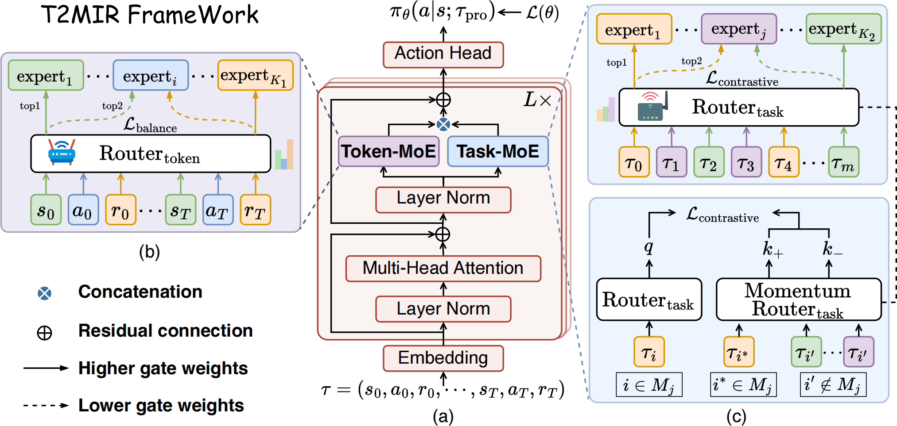

# Mixture-of-Experts Meets In-Context Reinforcement Learning
## Overview
Official codebase for T2MIR: Mixture-of-Experts Meets In-Context Reinforcement Learning.
([arXiv](https://arxiv.org/abs/2506.05426) and [Hugging Face](https://huggingface.co/papers/2506.05426))



## Requirements
The version of Python is `3.11.10`.
To install requirements, use:
```bash
pip install -r requirements.txt
```
Please follow [Meta-World](https://github.com/Farama-Foundation/Metaworld) to install Meta-World environments and [Flash-Attention](https://github.com/Dao-AILab/flash-attention) to install Flash-Attention.

## Training
- To train `T2MIR-AD`, use:
```bash
cd T2MIR-AD
python train.py cheetah-vel-v0 --exp exp_0 --seed 3407
```

- To train `T2MIR-DPT`, use:
```bash
cd T2MIR-DPT
python train.py cheetah-vel-v0 --exp exp_0 --seed 3407
```

## Evaluation
We provide a `checkpoint` to reproduce the results in the paper.

- To evaluate `T2MIR-AD`, use:
```bash
cd T2MIR-AD
python eval.py cheetah-vel-v0 1 --exp exp_0 --seed 3407 --start-ckpt 89000 --stop-ckpt 89000 --seed-eval 10
```

- To evaluate `T2MIR-DPT`, use:
```bash
cd T2MIR-DPT
python eval_online.py cheetah-vel-v0 1 --exp exp_0 --seed 3407 --start-ckpt 59000 --stop-ckpt 59000 --seed-eval 10
```

The results will be saved in `exp_0-seed_3407/eval_1-seed_10/eval_return.csv`.